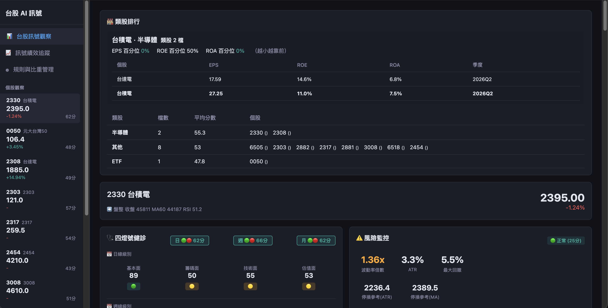
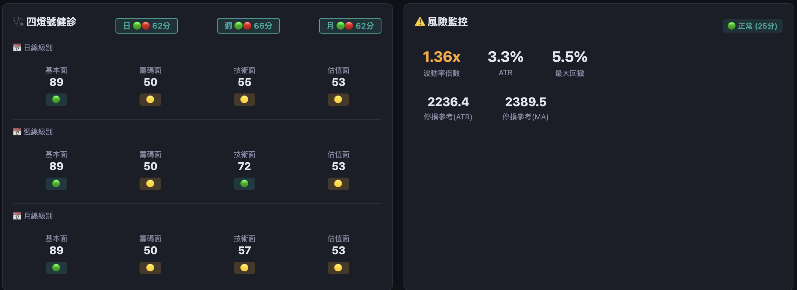
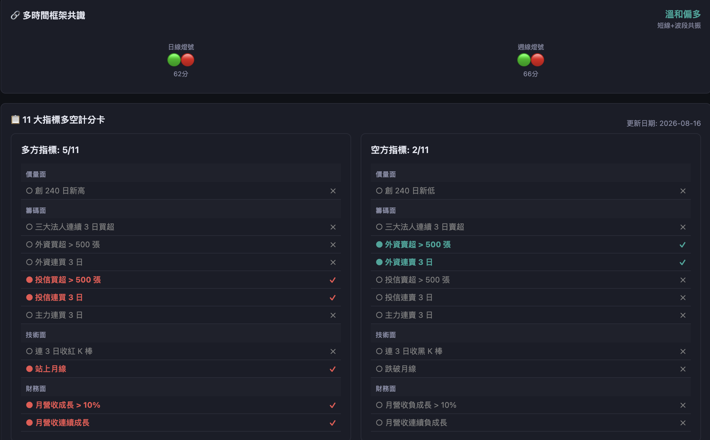
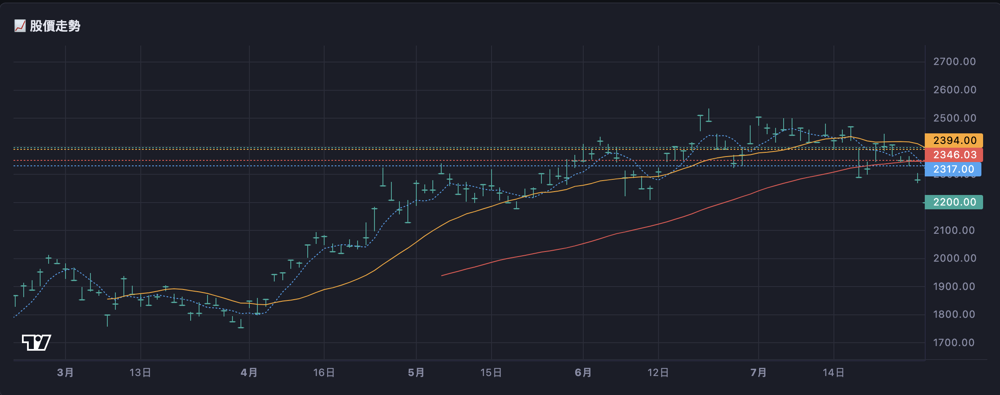
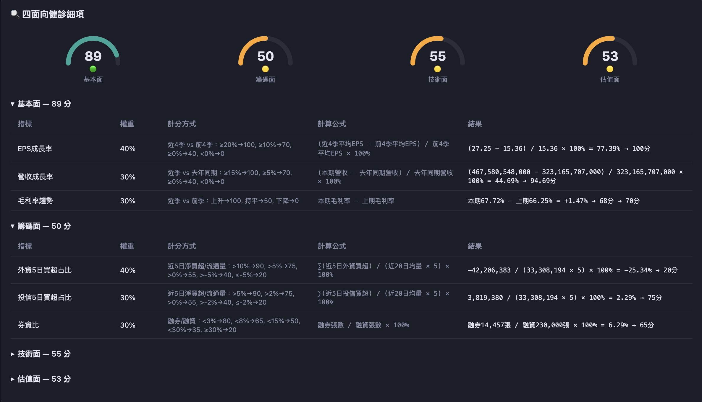
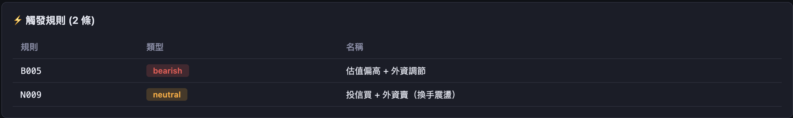
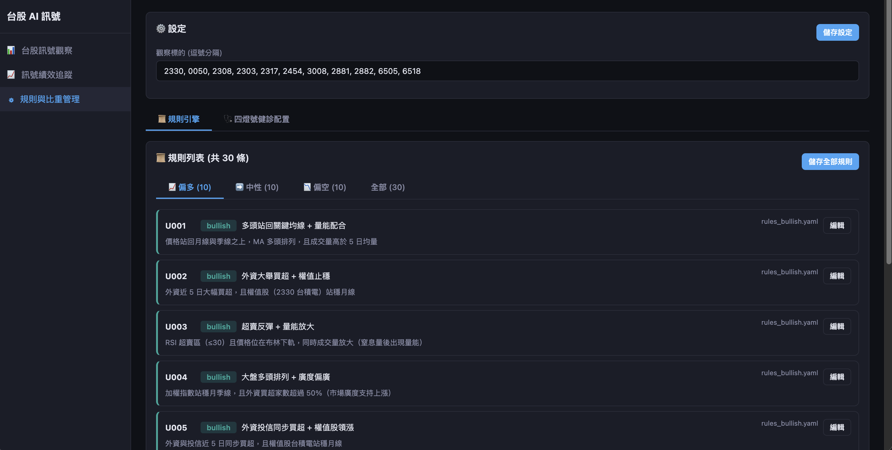

# tw-quant-signal

**台股 AI 量化訊號系統** — 資料驅動的四燈號健診、多時間框架掃描與自動化監控。

## Snapshots









## Overview

```
┌─────────────────────────────────────┐
│           Frontend (React/Vite)      │
│  儀表板 · 個股觀察 · 規則管理        │
└──────────┬──────────────────────────┘
           │ /api/*
┌──────────▼──────────────────────────┐
│         Backend (FastAPI + Uvicorn)  │
│  管線排程 · 評分引擎 · 規則引擎     │
│  風險管理 · 多時間框架 · 報告產出    │
└──────────┬──────────────────────────┘
           │ SQLite
┌──────────▼──────────────────────────┐
│         Data Layer (SignalDB)        │
│  19 張表 · 股價/指標/籌碼/財務/健診/衰退監控/日誌 │
└─────────────────────────────────────┘
```

## 系統架構

```
src/tw_quant_signal/
├── __init__.py
├── alerter.py          # 通知發送 (Telegram / Discord)
├── api/
│   └── app.py          # FastAPI 應用 (15+ 端點, SPA 靜態服務)
├── backfill.py         # 歷史回補腳本
├── backtest.py         # 規則回測框架
├── config.py           # 設定載入 (config.json + 環境變數)
├── db.py               # 資料庫層 (19 張表, CRUD 方法)
├── features.py         # 特徵工程 (技術/籌碼/估值 50+ 欄位)
├── health_check.py     # 四燈號健診評分引擎 (日/週/月三級別)
├── indicators.py       # 技術指標計算 (MA/RSI/BB/成交量/週線/月線)
├── ingestion.py        # 資料擷取引擎 (股價/指數/籌碼/融資券)
├── market_state.py     # 市場狀態判別 (多頭/空頭/盤整)
├── multi_timeframe.py  # 多時間框架共識整合 (日+週+月)
├── pipeline.py         # 每日管線主流程 (17 步驟)
├── reporter.py         # Markdown/CSV 報告產生
├── risk_manager.py     # 風險指標計算 (波動率/ATR/回撤/停損)
├── rules.py            # 規則引擎 (evaluate + aggregate + 加權)
├── structural_change.py # 結構變化偵測（規則衰退 / 特徵漂移 / 勝率衰退）
├── env_manager.py       # 研究/實戰環境分離與規則治理
├── operation_log.py     # 操作日誌與合規紀錄
├── provider/            # DataProvider 抽象層 (T020)
│   ├── base.py          #   DataProvider 抽象基底 (10 個 fetch_* 簽名)
│   ├── twse_direct.py   #   TwseDirectProvider (現有 HTTP 直連)
│   ├── yfinance_provider.py # YfinanceProvider (財務/股利補充)
│   ├── mcp_provider.py  #   McpDataProvider (tw-quant-mcp, T021 盤後 / T022 MOPS 全量)
│   ├── mcp_client.py    #   MCP stdio client (JSON-RPC 通訊, S1)
│   ├── mcp_normalize.py #   MCP Envelope → dict 格式轉換 (S4, T022 MOPS 擴充)
│   └── __init__.py      #   工廠 create_data_provider() + 模式切換
└── twse_client.py      # TWSE 資料源客戶端 (yfinance + FinMind)

configs/
├── health_check.yaml                   # 四面向權重 & 各指標閾值
├── rules_bullish.yaml                  # 多頭規則組合
├── rules_bearish.yaml                  # 空頭規則組合
└── rules_neutral.yaml                  # 中立規則組合

frontend/
└── src/
    ├── components/
    │   ├── DashboardCharts.tsx         # 儀表板圖表
    │   ├── GaugeChart.tsx              # 儀錶盤元件
    │   ├── HealthAspectDetail.tsx      # 四面向健診細項展開
    │   ├── HealthCheckCard.tsx         # 三級別燈號卡片 (日/週/月)
    │   ├── PriceChart.tsx              # 股價走勢圖
    │   ├── RiskCard.tsx                # 風險指標卡片
    │   └── Sidebar.tsx                 # 側邊導航
    ├── pages/
    │   ├── StockObservation.tsx        # 個股觀察頁 (含共識卡)
    │   └── RulesManagement.tsx         # 規則管理頁
    └── api/client.ts                   # API 客戶端
```

## 功能列表

### ✅ Phase 1 — 資料基礎建設
- **資料管線** — 每日自動擷取台股股價、大盤指數、法人籌碼、融資券
- **技術指標** — MA5/20/60、RSI(14)、布林通道(20,2)、成交量均線
- **特徵工程** — 50+ 技術/籌碼/估值特徵 (均線排列、RSI 訊號、法人趨勢、PE/PB 百分位)
- **規則引擎** — YAML 定義多/空/中立規則，多條件 AND/OR 組合，市場狀態加權
- **回測框架** — 含交易成本(稅/手續費)的歷史規則回測
- **訊號通知** — Telegram / Discord 自動推送

### ✅ Phase 2 — 評分與風控
- **四燈號健診** 🟢🟢🔴🟡🔴 — 基本面/籌碼面/技術面/估值面四向評分 (0-100)，YAML 可配
- **市場狀態切換** — 多頭/空頭/盤整自動判別，動態調整規則權重
- **風險控管** — 波動率比率、ATR 停損、回撤計算、訊號衝突偵測
- **儀表板前端** — React 即時儀表板、個股健診展開、規則管理 UI

### ✅ Phase 3 — 多時間框架
- **週線指標** — 週線 MA/RSI/BB，每週聚合計算
- **月線指標** — 月線 MA3/6/12、RSI(9)、BB(6)
- **三級別健診** — 日線·週線·月線各自獨立評分
- **多框架共識** — 56 種日+週組合映射 (強多→強空)，含 `conflicting` 訊號分類
- **API 完整暴露** — `/api/health`, `/api/weekly-health`, `/api/monthly-health`, `/api/multi-timeframe`

### ✅ Phase 3 — 結構變化偵測
- **規則觸發頻率漂移** — 比較近 20 日 vs 歷史觸發率，偵測規則是否過度活躍/沈默
- **規則滾動勝率衰退** — 以次日漲跌驗證訊號方向正確性，30% 以上衰退告警
- **特徵分布偏移** — 11 項數值特徵（RSI/PE/PB/成交量等）均值變化監控
- **健診評分系統性偏移** — 整體評分分布是否持續上升或下滑
- **三級警報** — watch(偏移30%) / warning(50%) / critical(70%) + 自動通報
- **不自動停用** — 衰退規則標記 `drift_status`，由人決定是否調整

### ✅ Phase 3 — 環境分離與治理
- **研究/實戰分離** — `TW_QUANT_MODE` 環境變數或 YAML 切換，不影響 git
- **實戰白名單** — `production_rule_ids` 列管規則，production mode 下過濾
- **規則晉升審核** — 門檻：回測交易≥30 / 勝率≥55% / Sharpe≥1.0，需人工確認
- **操作日誌** — 5 類紀錄（管線/訊號/規則/設定/模式切換），含版本 hash 快照
- **法規邊界** — `GOVERNANCE.md` 文件化，免責聲明自動附加於每日推播
- **合規報告** — `GET /api/compliance-report` 含操作軌跡與法規說明

### ✅ Phase 4 — 資料層抽象化 (T020)
- **DataProvider 統一介面** — 10 個 `fetch_*` 抽象方法（行情/指數/法人/估值/融資券/月營收/季報/股利/歷史資料）
- **可替換資料源** — `create_data_provider()` 工廠 + `TW_QUANT_DATA_PROVIDER=direct|mcp` 環境變數切換
- **TwseDirectProvider** — 現有 HTTP 直連封裝（twse_client 為內部實作）
- **YfinanceProvider** — 財務/股利補充提供者（yfinance 缺省時 graceful 降級）
- **上游零耦合** — ingestion / features / backtest / backfill 均改由 DataProvider 取數，替換資料源不需改動上層
- **向後相容** — direct 模式行為與舊程式碼完全一致（193 測試全通過）

### ✅ Phase 4 — TWSE 盤後資料遷移至 tw-quant-mcp (T021)
- **McpDataProvider 實作** — TWSE 盤後五方法（行情/指數/法人/估值/融資券）改由 tw-quant-mcp stdio JSON-RPC 提供
- **McpClient** — 輕量 stdio client：`subprocess.Popen` + JSON-RPC 2.0 + `MCP_SERVER_PATH` env + 健康檢查 ping + 重試 2 次/1s backoff
- **格式轉換層** — `mcp_normalize.py` 統一 MCP Envelope → Python dict 映射（含 % → 十進位殖利率）
- **Symbol Registry 檢查** — lazy 載入 `get_symbol_list`，ETF（0050）/指數自動降級 direct
- **S5 自動降級** — mcp 呼叫失敗/逾時 → warning log + pipeline_log `source=mcp|direct(fallback)` 標註，pipeline 不中斷
- **S6 端到端驗證** — 完整 pipeline 兩模式比對：daily_prices 共同交易日完全一致，mcp 模式資料更新（08-11 vs 08-10）
- **測試** — 209 passed（新增 16 個 T021 測試：成功路徑/降級/ETF/歷史逐月呼叫）

### ✅ Phase 4 — MOPS/基本面資料層遷移至 tw-quant-mcp (T022)
- **MOPS 三方法實作** — `fetch_monthly_revenue_batch`/`fetch_dividends`/`fetch_quarterly_financials_batch` 改由 tw-quant-mcp 提供（get_monthly_revenue / get_dividend_history / get_financial_statements）
- **格式轉換擴充** — 民國年→西元年（股利年度 +1911、年月 5/6 位判別）、pct 欄位映射、ROE/ROA 自資產負債表計算
- **YfinanceProvider 保留** — mcp 財報對部分公司（2330/1101/2317）無資料，自動降級 `direct(fallback)`；股利以 yfinance 補 ex_date/yield（見 KNOWN_ISSUES.md）
- **降級防重複 normalize** — 修復民國年雙重轉換 bug（2026→3937），以 payload 結構區分 mcp envelope vs fallback 結果
- **S5 驗證** — mcp 模式完整 ingestion：三表正常寫入（月營收 2 / 季報 8 / 股利 8 筆）
- **測試** — 211 passed（新增 2 個降級測試）

### 📋 待實作
| Task | 說明 |
|------|------|
| 個股池訊號 (T010) | 精選觀察清單掃描引擎 |

## 快速開始

### 前置需求
- Python >= 3.10
- Node.js >= 20

### 安裝

```bash
# Python 後端
cd tw-quant-signal
python3 -m venv .venv
source .venv/bin/activate
pip install -e .

# 前端
cd frontend
npm install
npm run build
```

### 設定

編輯 `config.json`：

```json
{
    "watch_stocks": ["2330", "0050", "2308"],
    "notification": {
        "telegram_bot_token": "<your-token>",
        "telegram_chat_id": "<your-chat-id>",
        "discord_webhook_url": "<your-webhook-url>"
    },
    "database": {
        "path": "data/signal.db"
    }
}
```

也可以透過環境變數覆蓋：

| 變數 | 用途 |
|------|------|
| `TW_QUANT_DB` | 資料庫路徑 |
| `TW_QUANT_DATA_PROVIDER` | 資料來源模式 (`direct` 現有 HTTP 直連 / `mcp` tw-quant-mcp，預設 `direct`) |
| `MCP_SERVER_PATH` | tw-quant-mcp 執行檔路徑（`mcp` 模式用；未設定時依 PATH） |
| `MCP_CALL_TIMEOUT` | mcp 單次 tool 呼叫逾時秒數（預設 30） |
| `TELEGRAM_BOT_TOKEN` | Telegram Bot Token |
| `TELEGRAM_CHAT_ID` | Telegram 聊天室 ID |
| `DISCORD_WEBHOOK_URL` | Discord Webhook URL |

評分權重與閾值在 `configs/health_check.yaml` 中設定：

```yaml
aspect_weights:
  fundamental: 25
  institutional: 25
  technical: 25
  valuation: 25
```

### 執行

```bash
# 啟動 API + 前端 (http://localhost:8000)
uvicorn tw_quant_signal.api.app:app --host 0.0.0.0 --port 8000

# 手動執行每日管線
python -m tw_quant_signal.pipeline

# 歷史資料回補 (2330 從 2024-01-01 起)
python -c "from tw_quant_signal.backfill import main; main()"

# 規格回測
python -m tw_quant_signal.backtest
```

### Docker

```bash
docker compose up -d                    # API → port 8000
docker compose --profile scheduler up   # 額外啟動定時排程容器
```

定時排程預設在每個交易日 15:00 執行管線 (`scripts/scheduler_cron.sh`)。

## API 端點

| 端點 | 用途 |
|------|------|
| `GET /api/stocks` | 觀察清單一覽 (收盤/漲跌/健診/風險) |
| `GET /api/stocks/{id}/detail` | 個股完整詳情 (含三級別健診+多框架共識) |
| `GET /api/market-state` | 大盤市場狀態 (多/空/盤整) |
| `GET /api/dashboard` | 儀表板聚合資料 |
| `GET /api/health` | 日線四燈號健診 |
| `GET /api/weekly-health` | 週線健診 |
| `GET /api/monthly-health` | 月線健診 |
| `GET /api/multi-timeframe` | 多時間框架共識 |
| `GET /api/structural-drift` | 結構變化偵測結果 (可選 `?today_only=false`) |
| `GET /api/drift-report` | 結構變化 Markdown 報告 |
| `GET /api/environment` | 當前環境狀態（模式、白名單、規則 hash） |
| `GET /api/compliance-statement` | 法規邊界聲明 |
| `GET /api/compliance-report` | 合規報告（操作軌跡 + 免責聲明） |
| `GET /api/operation-log` | 操作日誌（?days=7） |
| `GET /api/health-check-config` | 健診評分配置 |
| `PUT /api/health-check-config` | 更新健診配置 |
| `GET /api/rules` | 規則列表 |
| `PUT /api/rules` | 更新規則 |
| `GET /api/config` | 系統設定 |
| `PUT /api/config` | 更新設定 |

## 資料庫 Schema (SignalDB)

19 張表涵蓋完整管線：

| 表 | 用途 |
|----|------|
| `pipeline_log` | 每日管線執行狀態 |
| `daily_prices` | 日線股價 (OHLCV) |
| `market_index` | 大盤指數 |
| `institutional_flows` | 三大法人買賣超 |
| `signals` / `rule_signals` | 規則訊號觸發紀錄 |
| `features` | 特徵工程產出 (JSON) |
| `tech_indicators` | 日線技術指標 |
| `weekly_indicators` | 週線技術指標 |
| `monthly_indicators` | 月線技術指標 |
| `financial_data` | 季財務數據 (EPS/營收/毛利率) |
| `margin_data` | 融資券數據 |
| `risk_metrics` | 風險指標 |
| `health_scores` | 日線四燈號健診評分 |
| `weekly_health_scores` | 週線健診評分 |
| `monthly_health_scores` | 月線健診評分 |
| `multi_timeframe_consensus` | 多時間框架共識 |
| `structural_drift` | 結構變化偵測（規則衰退/特徵偏移） |
| `operation_log` | 操作日誌（訊號產出/規則變更/模式切換） |

## 知識庫 / 參考

完整的任務追蹤與決策記錄在獨立知識庫中，包含：

- **13 份 Task 開發文件** — 每個功能的設計、實作細節與驗收標準
- **開發文件與 README** — 狀態矛盾已同步 (2026-07-30)
- **Review 記錄** — 含改善建議 (ARCHITECTURE.md、任務依賴矩陣)
- **已知資料源限制表** — TwseClient 口徑差異、FinMind 延遲

（知識庫為獨立 Git repo，由 GitHub Issues 任務追蹤。如需查看，請向維護者索取權限。）

## License
---

本專案採用 **Apache License 2.0** 授權。

- 完整授權條款見 [`LICENSE`](LICENSE)（專案根目錄）
- Apache-2.0 官方條款：<https://www.apache.org/licenses/LICENSE-2.0>
- 版權與貢獻者資訊以 LICENSE 檔案為準

> 本專案為研究/模擬用途，授權條款不構成任何投資建議或保證；
> 使用/修改/再散佈前請詳閱 LICENSE 全文。
